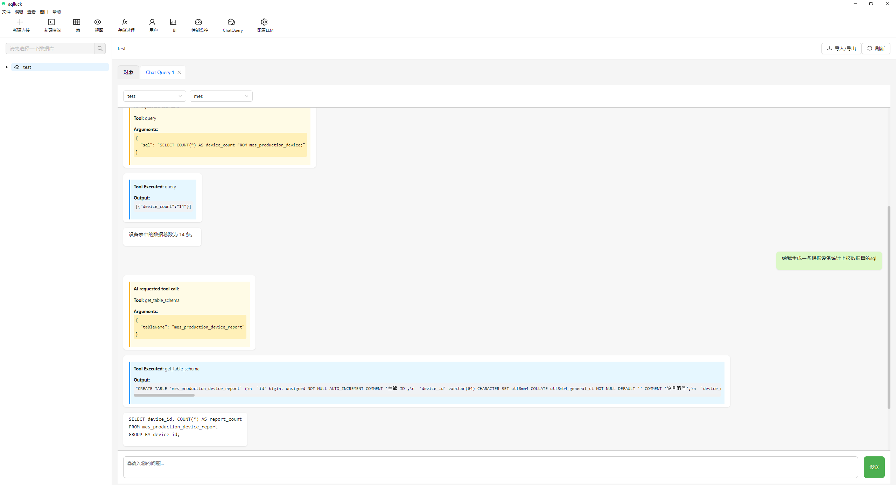
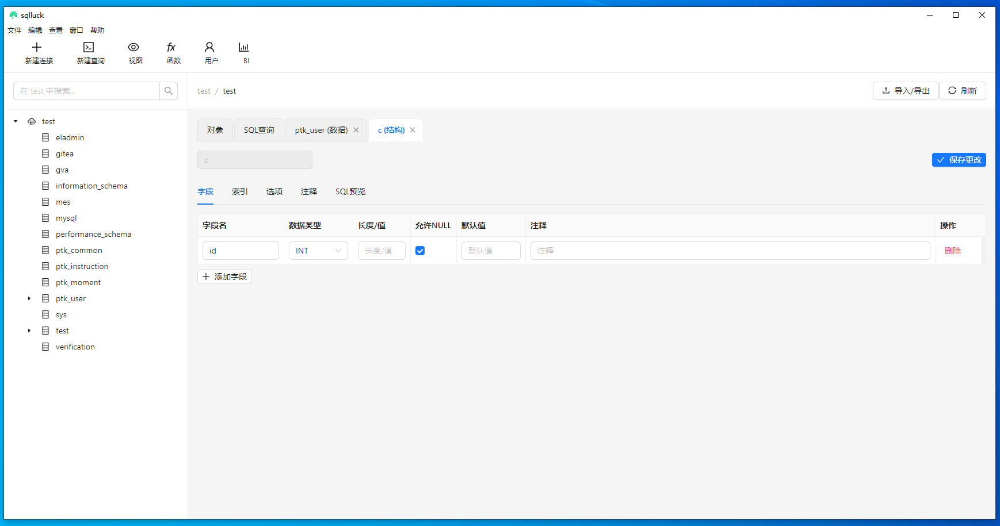
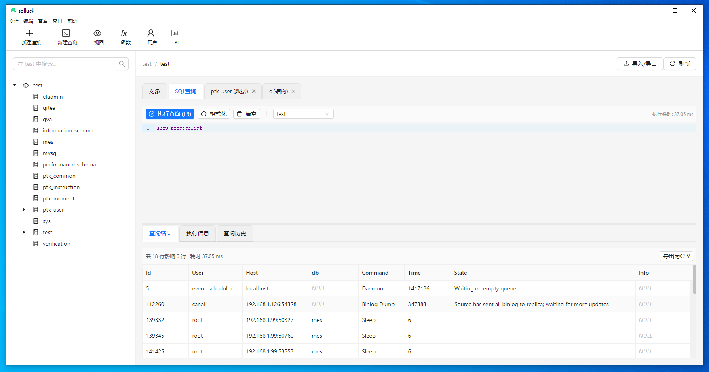

# MySQL Client App

一个独立的 MySQL 数据库客户端管理工具，基于原 VS Code 数据库扩展改造。

## 特性

- 🔗 MySQL 数据库连接管理
- 🗂️ 数据库和表结构浏览
- 📝 SQL 查询编辑器（语法高亮）
- 📊 查询结果展示和数据编辑
- 📤 数据导入导出功能
- 🖥️ 跨平台桌面应用

## 技术栈

- **后端**: Node.js + Express + MySQL2
- **前端**: Vue.js + Element Plus
- **桌面**: Electron
- **构建**: Vite + TypeScript

## 开发环境启动

```bash
# 安装依赖
npm install

# 启动开发环境
npm run dev
```

## 构建和打包

```bash
# 构建所有模块
npm run build

# 启动应用
npm start
```

## 项目结构

```
mysql-client-app/
├── backend/          # Node.js后端服务
├── frontend/         # Vue.js前端界面
├── electron/         # Electron主进程
└── package.json      # 项目配置
```

## 项目截图




